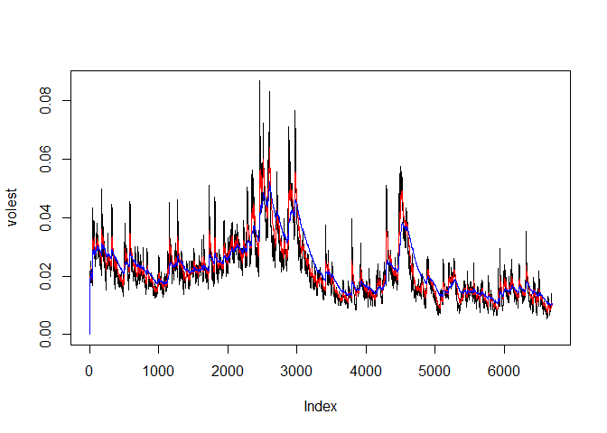

# Decayed Returns Volatility Curves
Jack K. Rasmus-Vorrath  
July 22, 2017  

#The following calculates log returns and volatility measures of time series data on Intel Corporation stock performance using three different decay factors.


```r
library(tseries)
options("getSymbols.warning4.0"=FALSE)
options("getSymbols.yahoo.warning"=FALSE)
INTCdata <- get.hist.quote('INTC', quote = 'Close')
```

```
## time series ends   2017-07-20
```

```r
head(INTCdata)
```

```
##               Close
## 1991-01-02 1.203125
## 1991-01-03 1.203125
## 1991-01-04 1.210938
## 1991-01-07 1.199219
## 1991-01-08 1.187500
## 1991-01-09 1.199219
```

##Lagged Log Returns

```r
INTCret <- log(lag(INTCdata)) - log(INTCdata)
head(INTCret)
```

```
##                   Close
## 1991-01-02  0.000000000
## 1991-01-03  0.006472927
## 1991-01-04 -0.009724754
## 1991-01-07 -0.009820255
## 1991-01-08  0.009820255
## 1991-01-09  0.009724754
```

##Calculated Volatility Measure

```r
INTCvol <- sd(INTCret) * sqrt(250) * 100
INTCvol
```

```
## [1] 38.1887
```

##Exponentially Downweighted Continuous Lookback Window

```r
Vol <- function(d, logrets){
  var = 0
  lam = 0
  varlist <- c()
  for (r in logrets){
    lam = lam*(1 - 1/d) + 1
    var = (1 - 1/lam)*var + (1/lam)*r^2
    varlist <- c(varlist, var)
  }
  sqrt(varlist)
}
volest <- Vol(10, INTCret)
head(volest)
```

```
## [1] 0.000000000 0.004695955 0.006986538 0.007915833 0.008420722 0.008715422
```

```r
volest2 <- Vol(30, INTCret)
head(volest2)
```

```
## [1] 0.000000000 0.004615676 0.006823420 0.007724619 0.008217671 0.008510424
```

```r
volest3 <- Vol(100, INTCret)
head(volest3)
```

```
## [1] 0.000000000 0.004588537 0.006768069 0.007658712 0.008146461 0.008437104
```

##Plotted Volatility Curves

```r
plot(volest, type = 'l')
lines(volest2, type = 'l', col = 'red')
lines(volest3, type = 'l', col = 'blue')
```

<!-- -->

#The volatility curve with decay factor 0.99 demonstrates substantially smoother features.
